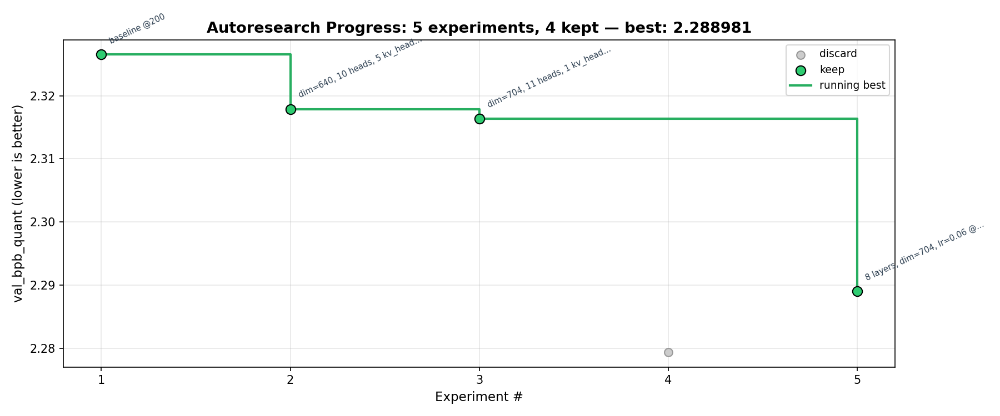

# ChrisGoesGolfing

Auto-iterative Parameter Golf research loop, adapted from [Karpathy's autoresearch](https://github.com/karpathy/autoresearch) for the [OpenAI Parameter Golf](https://github.com/openai/parameter-golf) challenge.

An AI agent autonomously iterates on a small GPT model, trying to minimize bits-per-byte (BPB) on FineWeb while keeping the artifact under 16MB (int8+zlib compressed).



## Results

| # | Commit | Iterations | val_bpb_quant | Artifact | Status | Description |
|---|--------|------------|---------------|----------|--------|-------------|
| 1 | 9326e13 | 200 | 2.326520 | 10.1 MB | keep | baseline @200 |
| 2 | 973c47e | 200 | 2.317869 | 13.8 MB | keep | dim=640, 10 heads, 5 kv_heads @200 |
| 3 | 63ee03b | 200 | 2.316331 | 15.1 MB | keep | dim=704, 11 heads, 1 kv_head (MQA) @200 |
| 4 | 57f53b3 | 200 | 2.279354 | 16.5 MB | discard | matrix_lr=0.06 (artifact FAIL) @200 |
| 5 | 2daa918 | 200 | 2.288981 | 15.3 MB | keep | 8 layers, dim=704, lr=0.06 @200 |
| 6 | 2c4cdf5 | 565 | 1.990023 | 17.3 MB | discard | full run dim=704 8L lr=0.08 (artifact FAIL) |

**Current best: 2.288981** (8 layers, dim=704, lr=0.06 @200)

## Changelog

- **#5** `2daa918` — 8 layers, dim=704, lr=0.06 @200 → **2.288981** (best)
- **#3** `63ee03b` — dim=704, 11 heads, 1 kv_head (MQA) @200 → **2.316331**
- **#2** `973c47e` — dim=640, 10 heads, 5 kv_heads @200 → **2.317869**
- **#1** `9326e13` — baseline @200 → **2.326520**

## Setup

```bash
python3 -m venv .venv && source .venv/bin/activate
pip install -r requirements.txt
python prepare.py            # downloads FineWeb data + tokenizer
```

## Usage

The agent reads `PROMPT.md` for instructions, then runs the research loop:

1. Modify `train.py` (model architecture, hyperparameters, optimizer)
2. Commit & push changes
3. Run `python train.py > run.log 2>&1`
4. Parse results, log to `results.tsv`
5. If improved: regenerate graph, update README, push
6. If not: git reset, push
7. Repeat forever

## Files

- `prepare.py` — Fixed: data download, tokenizer, evaluation, quantization. **Do not modify.**
- `train.py` — Editable: model architecture, optimizer, hyperparameters, training loop.
- `PROMPT.md` — Agent instructions for the autonomous research loop.
- `plot_progress.py` — Generates `progress.png` step graph from `results.tsv`.
- `results.tsv` — Full experiment log (tracked in git).
- `analysis.ipynb` — Notebook for analyzing experiment results.
